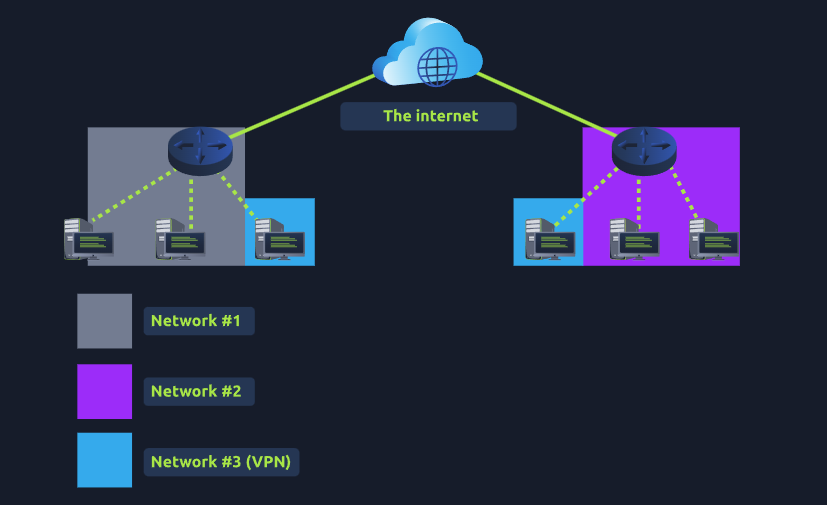

# Réseaux Privés Virtuels (VPN)

## Qu'est-ce qu'un VPN ?
Un **VPN** (Virtual Private Network) est une technologie qui permet à des appareils sur des réseaux séparés de communiquer de manière sécurisée en créant un chemin dédié (appelé tunnel) entre eux via Internet. Les appareils connectés via ce tunnel forment leur propre réseau privé.

### Illustration : Communication via un VPN
Un VPN permet à deux bureaux d'être connectés de manière sécurisée. Prenons l'exemple du diagramme ci-dessous où trois réseaux sont impliqués :

1. **Réseau #1** : Bureau #1
2. **Réseau #2** : Bureau #2
3. **Réseau #3** : Réseau VPN reliant les deux bureaux

Les appareils connectés au Réseau #3 font toujours partie des Réseaux #1 et #2, mais ils forment ensemble un réseau privé où seuls les appareils connectés via le VPN peuvent communiquer.

---

## Avantages des VPN
Voici quelques avantages des VPN présentés dans le tableau ci-dessous :

| **Avantage**                               | **Description**                                                                                                                                   |
|-------------------------------------------|---------------------------------------------------------------------------------------------------------------------------------------------------|
| **Connecte des réseaux distants**         | Par exemple, une entreprise avec plusieurs bureaux peut connecter ses ressources (serveurs, infrastructures) pour un accès commun sécurisé.        |
| **Offre la confidentialité**              | Les VPN utilisent le chiffrement pour protéger les données, empêchant les interceptions ou attaques sur les réseaux publics (comme le WiFi).       |
| **Offre l'anonymat**                      | Journalistes et activistes utilisent les VPN pour protéger leur identité lorsqu’ils travaillent dans des pays où la liberté d’expression est limitée. |

---

## Technologies VPN
Au fil des années, la technologie VPN a évolué. Voici un aperçu des principales technologies VPN :

| **Technologie VPN** | **Description**                                                                                                                                         |
|---------------------|---------------------------------------------------------------------------------------------------------------------------------------------------------|
| **PPP**             | Protocole utilisé pour l'authentification et le chiffrement des données via une clé privée et un certificat public. Non routable par lui-même.          |
| **PPTP**            | Le Point-to-Point Tunneling Protocol permet au PPP de voyager à travers les réseaux. Facile à configurer, mais offre un chiffrement faible.              |
| **IPSec**           | Le protocole Internet Protocol Security chiffre les données via le cadre IP existant. Offre un chiffrement robuste mais est complexe à configurer.      |

