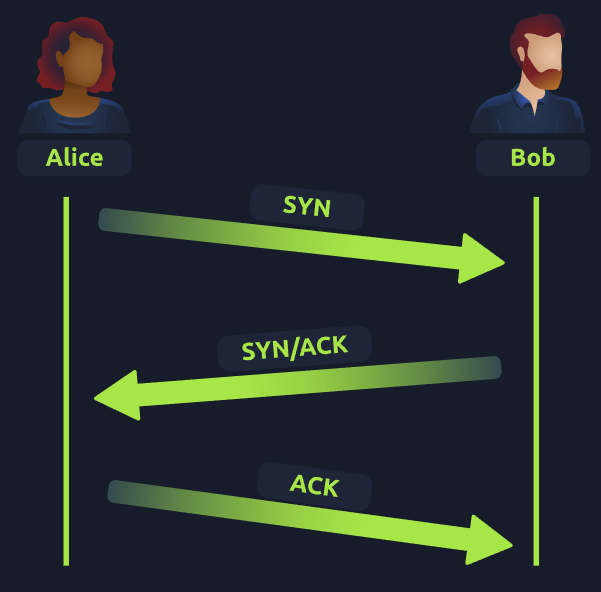
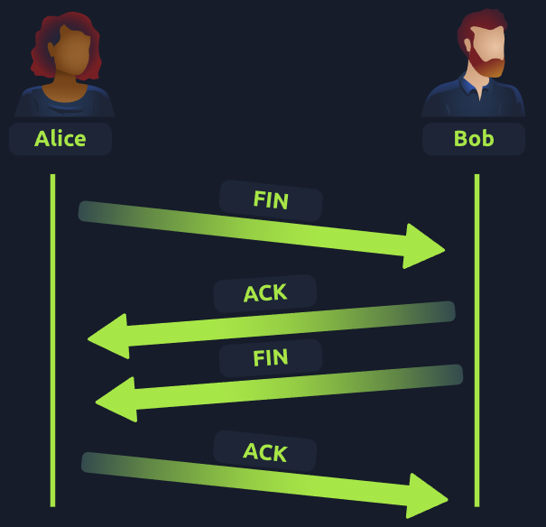

# Packets et Trames : TCP/IP (Le Three-Way Handshake)

## Introduction au TCP
**TCP** (Transmission Control Protocol) est une des règles fondamentales utilisées en mise en réseau.

Ce protocole est très similaire au modèle OSI que nous avons précédemment discuté. Le protocole TCP/IP comporte quatre couches principales, qui peuvent être considérées comme une version simplifiée du modèle OSI :
- **Application**
- **Transport**
- **Internet**
- **Interface réseau**

### Encapsulation et Décapsulation
Similaire au fonctionnement du modèle OSI, des informations sont ajoutées à chaque couche du modèle TCP lorsque les données traversent le réseau. Ce processus est appelé **encapsulation** (le processus inverse étant la **décapsulation**).

### Caractéristiques du TCP
Le TCP est **basé sur les connexions**, ce qui signifie qu’il doit établir une connexion entre un client et un serveur avant l’envoi de données. Cela garantit que toutes les données envoyées seront reçues correctement. Ce processus est appelé **Three-Way Handshake** (ou établissement en trois étapes).

| **Avantages de TCP**                                           | **Inconvénients de TCP**                                           |
|---------------------------------------------------------------|--------------------------------------------------------------------|
| Garantit l'intégrité des données.                             | Nécessite une connexion fiable entre les appareils. Si une partie des données est perdue, tout doit être renvoyé. |
| Permet de synchroniser deux appareils pour éviter un envoi dans un ordre incorrect. | Une connexion lente peut ralentir un autre appareil, car elle réserve des ressources réseau. |
| Effectue plus de processus pour garantir la fiabilité.        | Plus lent que l'UDP, car il exige plus de calculs et de vérifications. |

---

## En-têtes TCP (Headers)
Les paquets TCP contiennent plusieurs sections d'informations appelées **en-têtes**. Voici les en-têtes principaux expliqués dans le tableau ci-dessous :

| **En-tête**          | **Description**                                                                                                                                             |
|-----------------------|-------------------------------------------------------------------------------------------------------------------------------------------------------------|
| **Port source**       | Le port ouvert par l'expéditeur pour envoyer le paquet TCP. Choisi aléatoirement (entre 0 et 65535 non utilisés).                                           |
| **Port de destination** | Le numéro de port utilisé par l'application ou le service sur l'hôte distant (par exemple, un serveur web sur le port 80).                                |
| **IP source**         | L'adresse IP de l'appareil envoyant le paquet.                                                                                                             |
| **IP de destination** | L'adresse IP de l'appareil destinataire.                                                                                                                   |
| **Numéro de séquence**| Lorsqu'une connexion s'établit, le premier paquet envoyé reçoit un numéro de séquence aléatoire.                                                           |
| **Numéro d'accusé de réception** | Après qu'une donnée a été envoyée avec un numéro de séquence, la suivante reçoit un numéro de séquence incrémenté.                                  |
| **Checksum**          | Permet d'assurer l'intégrité du paquet TCP à l'aide de calculs mathématiques. Si la sortie est différente, le paquet est corrompu.                         |
| **Données**           | Contient les données transmises (par exemple, les octets d'un fichier).                                                                                    |
| **Drapeau (Flag)**    | Définit le comportement du paquet lors du processus de handshake. Les flags spécifiques seront expliqués ci-dessous.                                       |

---

## Le Three-Way Handshake
Le processus **Three-Way Handshake** est utilisé pour établir une connexion entre deux appareils. Voici les étapes principales :

| **Étape** | **Message** | **Description**                                                                                                  |
|-----------|-------------|------------------------------------------------------------------------------------------------------------------|
| 1         | **SYN**     | Le client envoie un message SYN pour initier une connexion et synchroniser avec l'autre appareil.               |
| 2         | **SYN/ACK** | Le serveur envoie un message SYN/ACK pour reconnaître la tentative de synchronisation du client.                |
| 3         | **ACK**     | Le client envoie un accusé de réception (ACK) pour confirmer l'établissement de la connexion.                    |
| 4         | **DATA**    | Une fois la connexion établie, les données (comme les fichiers ou messages) sont transmises.                    |
| 5         | **FIN**     | Utilisé pour fermer proprement la connexion une fois terminée.                                                  |
| #         | **RST**     | Interrompt brusquement toutes les communications en cas de problème.                                            |

### Illustration : Établissement de la connexion

---

## Fermeture d'une Connexion TCP
Une fois toutes les données reçues, il est préférable de fermer la connexion pour libérer les ressources réseau. Le processus de fermeture inclut l'envoi d'un message **FIN** à l'autre appareil.

### Illustration : Fermeture de la connexion

---

Si vous avez d'autres suggestions ou ajustements, dites-le-moi !
