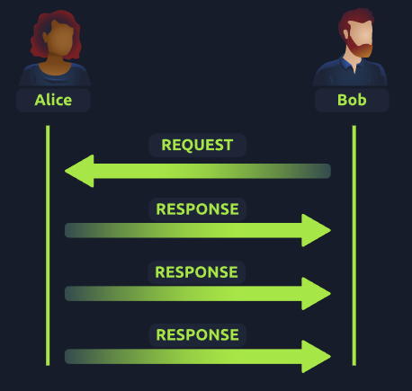

# Packets et Trames : UDP/IP

## Introduction au UDP
**UDP** (User Datagram Protocol) est un autre protocole utilisé pour communiquer des données entre appareils.

Contrairement à son homologue **TCP**, **UDP** est un protocole **sans état** (*stateless*) qui ne nécessite pas de connexion constante entre deux appareils pour transmettre des données. Par exemple, le processus de **Three-Way Handshake** n’a pas lieu, et il n’y a aucune synchronisation entre les appareils.

UDP est utilisé dans des situations où les applications peuvent tolérer la perte de données (comme le streaming vidéo ou les appels vocaux) ou lorsque la connexion instable n’est pas critique.

| **Avantages de UDP**                                           | **Inconvénients de UDP**                                           |
|---------------------------------------------------------------|--------------------------------------------------------------------|
| UDP est beaucoup plus rapide que TCP.                         | UDP ne vérifie pas si les données sont reçues ou non.             |
| UDP laisse à l’application (logiciel utilisateur) le contrôle sur la vitesse d’envoi des paquets. | Peut entraîner une expérience utilisateur désagréable en cas de connexion instable. |
| UDP ne réserve pas de connexion continue comme le fait TCP.   | Il n’y a aucune vérification ou intégrité des données transmises. |

---

## En-têtes UDP (Headers)
Les paquets UDP sont beaucoup plus simples que les paquets TCP et contiennent moins d’en-têtes. Cependant, certains en-têtes sont communs aux deux protocoles. Voici les principaux en-têtes UDP :

| **En-tête**          | **Description**                                                                                                                                             |
|-----------------------|-------------------------------------------------------------------------------------------------------------------------------------------------------------|
| **Time to Live (TTL)**| Définit un délai d’expiration pour empêcher les paquets de circuler indéfiniment sur le réseau.                                                             |
| **Adresse source**    | L’adresse IP de l’appareil émetteur du paquet.                                                                                                             |
| **Adresse de destination** | L’adresse IP de l’appareil destinataire du paquet.                                                                                                  |
| **Port source**       | Le port ouvert par l’expéditeur pour envoyer le paquet UDP (choisi aléatoirement entre 0 et 65535).                                                        |
| **Port de destination** | Le numéro de port utilisé par l’application ou service sur l’hôte distant (par exemple, un serveur web sur le port 80).                                 |
| **Données**           | Contient les données transmises (par exemple, les octets d’un fichier).                                                                                    |

---

## Fonctionnement du UDP
Le processus de connexion via UDP est très différent de celui de TCP. UDP étant sans état (*stateless*), il n’envoie pas d’accusé de réception lors d’une connexion.

Voici une illustration montrant une connexion typique entre deux appareils utilisant UDP :

